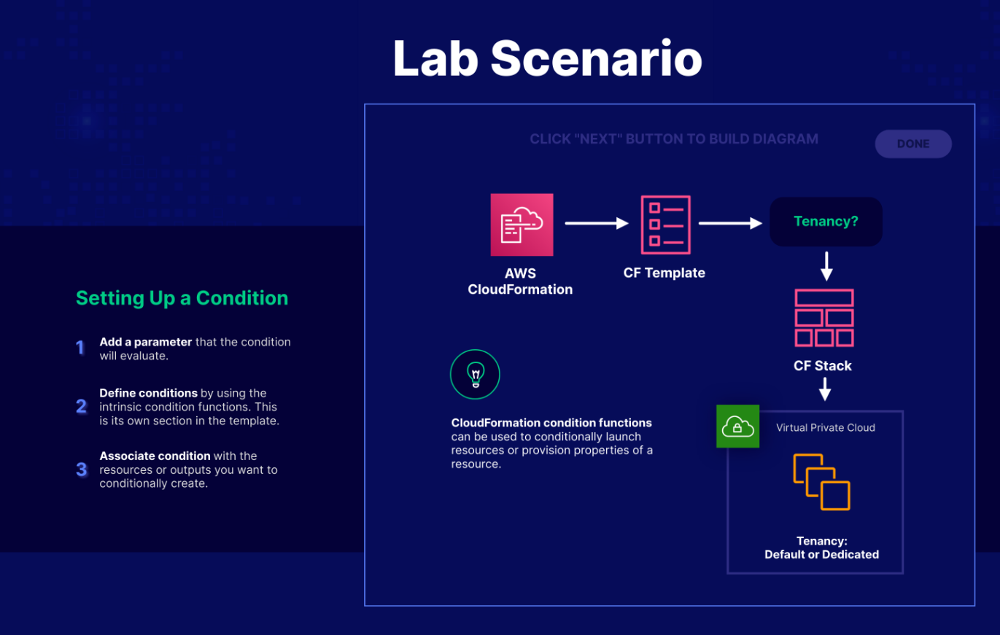

# Lab 02 - [AWS CloudFormation - Condition Functions](https://learn.acloud.guru/handson/234d14a4-2051-4ec1-a282-c64493dd47eb)

**NOTE: Use an A Cloud Guru (ACG) AWS Playground for this lab**

**If you encounter "no space left on device issues", use https://ryansouthgate.com/aws-cloud9-no-space-left-on-device/#:~:text=There%E2%80%99s%20a%20few%20things%20we%20can%20tackle%20here%2C,clean%20up%20that%20much%20free%20space%20for%20me**

1. In the lab environment, create a new Cloud9 environment using the following steps:
    - Open `CloudShell` (in the upper right)
    - Clone this repository to `CloudShell` using `git clone https://github.com/KernelGamut32/cloud-accel-aws-2024-public.git`
    - Navigate to the root folder using `cd cloud-accel-aws-2024-public`
    - Execute the bash script to create a new Cloud9 environment using `./cloud9.sh '<env-name>' 't3.medium' 'amazonlinux-2023-x86_64'` (replace `<env-name>` with your environment name)
    - Close `CloudShell`
    - In the search bar, search for `Cloud9` (open in a new tab)
    - Click the radio button next to your environment and click `Open in Cloud9`
    - Execute the remaining instructions in the Cloud9 environment
1. In the provided terminal, clone this repository using `git clone https://github.com/KernelGamut32/cloud-accel-aws-2024-public.git`
1. In the project view on the left, navigate to the week 01/lab 02 folder and open `vpc-initial.json`
1. Update the VPC resource name attribute **AND** the tag value, replacing `<initials>` with your initials; **save your changes**
1. Push the CloudFormation template to AWS using `aws cloudformation create-stack --stack-name vpc --template-body file://./cloud-accel-aws-2024-public/week01/labs/lab02/vpc-initial.json`
1. Run `aws cloudformation describe-stack-events --stack-name vpc` to view the status of the stack creation
1. Navigate to `VPC` in the MC to view your newly-created VPC; in the properties, tenancy will show `Dedicated`
1. Open `vpc-with-condition.json` and, once again, replace `<initials>` with your initials; **save your changes**
1. Push the CloudFormation template for the new VPC using `aws cloudformation create-stack --stack-name vpc2 --template-body file://./cloud-accel-aws-2024-public/week01/labs/lab02/vpc-with-condition.json --parameters ParameterKey=Tenancy,ParameterValue=default`
1. Review the new VPC in the MC and notice the tenancy setting
1. In the terminal, run `aws cloudformation update-stack --stack-name vpc2 --template-body file://./cloud-accel-aws-2024-public/week01/labs/lab02/vpc-with-condition.json --parameters ParameterKey=Tenancy,ParameterValue=dedicated` to apply the updates to the stack
1. Review the updates to the VPN in MC
1. Run `aws cloudformation delete-stack --stack-name vpc` and `aws cloudformation delete-stack --stack-name vpc2` to delete the stacks and the underlying resources in AWS
1. Once the operation completes (you can monitor in MC), you can verify that VPCs have been deleted
