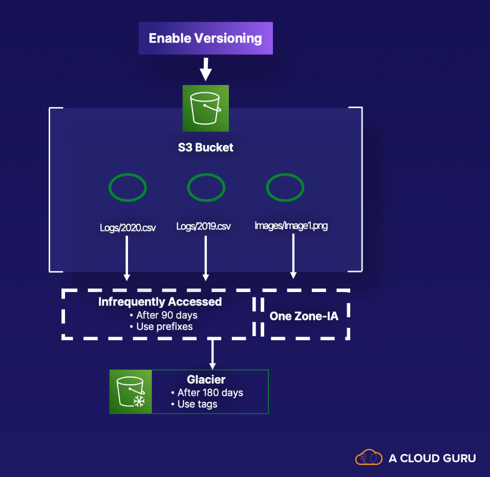

# Lab 08 - [S3 Lifecycle Rules](https://learn.acloud.guru/handson/9366814c-d237-4e04-9b64-e7c4e0cf1884)

**NOTE: Use an A Cloud Guru (ACG) AWS Playground for this lab**

**If you encounter "no space left on device issues", use https://ryansouthgate.com/aws-cloud9-no-space-left-on-device/#:~:text=There%E2%80%99s%20a%20few%20things%20we%20can%20tackle%20here%2C,clean%20up%20that%20much%20free%20space%20for%20me**

1. In the lab environment, create a new Cloud9 environment using the following steps:
    - Open `CloudShell` (in the upper right)
    - Clone this repository to `CloudShell` using `git clone https://github.com/KernelGamut32/cloud-accel-aws-2024-public.git`
    - Navigate to the root folder using `cd cloud-accel-aws-2024-public`
    - Execute the bash script to create a new Cloud9 environment using `./cloud9.sh '<env-name>' 't3.medium' 'amazonlinux-2023-x86_64' <sleep-time>` (replace `<env-name>` with your environment name and `<sleep-time>` with the targeted delay)
    - Close `CloudShell`
    - In the search bar, search for `Cloud9` (open in a new tab)
    - Click the radio button next to your environment and click `Open in Cloud9`
    - Execute the remaining instructions in the Cloud9 environment
1. In the provided terminal, clone this repository using `git clone https://github.com/KernelGamut32/cloud-accel-aws-2024-public.git`
1. In the project view on the left, navigate to the week 01/lab 08 folder and open `lab-resources.yaml` to review the template definition
1. Push the CloudFormation template to AWS using `aws cloudformation create-stack --stack-name s3lifecycle --template-body file://./cloud-accel-aws-2024-public/week01/labs/lab08/lab-resources.yaml`
1. Run `aws cloudformation describe-stack-events --stack-name s3lifecycle` to view the status of the stack creation
1. Navigate to `S3` in the AWS Management Console and review the bucket configuration including relevant lifecycle rules
1. **NOTE: Lifecycle rules run once per day and results may not be immediate depending on the rules setup** 
1. Run `aws cloudformation delete-stack --stack-name s3lifecycle` to delete the stack and the underlying resources in AWS
