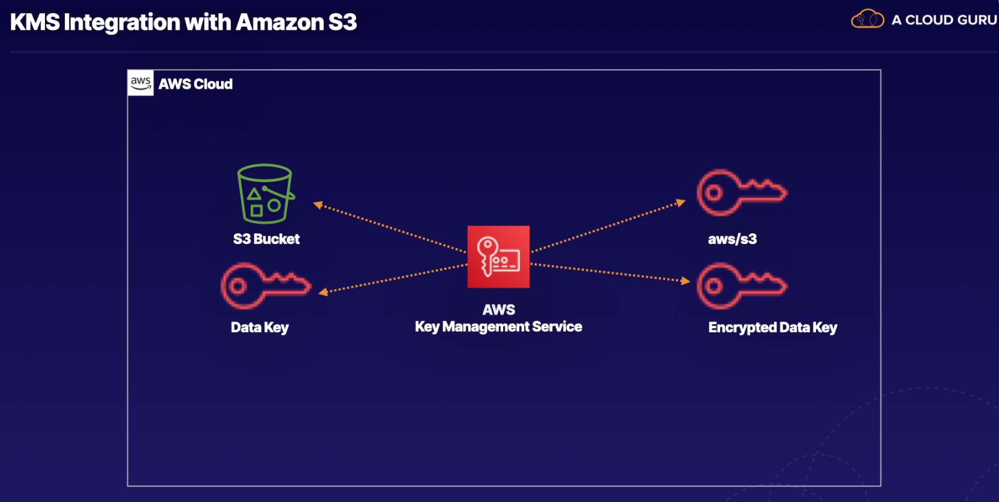

# Lab 01 - [Securing S3](https://learn.acloud.guru/handson/e4e6a251-06af-4046-992b-84f0ece1d3fb)

**NOTE: Use an A Cloud Guru (ACG) AWS Playground for this lab**

**If you encounter "no space left on device issues", use https://ryansouthgate.com/aws-cloud9-no-space-left-on-device/#:~:text=There%E2%80%99s%20a%20few%20things%20we%20can%20tackle%20here%2C,clean%20up%20that%20much%20free%20space%20for%20me**

Review/highlight https://docs.aws.amazon.com/AmazonS3/latest/userguide/UsingEncryption.html and https://www.encryptionconsulting.com/amazon-s3-simple-storage-service-encryption-at-a-glance. for additional information.

As part of this lab, we will also review Former2 (https://former2.com/).

1. In the lab environment, create a new Cloud9 environment using the following steps:
    - Open `CloudShell` (in the upper right)
    - Clone this repository to `CloudShell` using `git clone https://github.com/KernelGamut32/cloud-accel-aws-2024-public.git`
    - Navigate to the root folder using `cd cloud-accel-aws-2024-public`
    - Execute the bash script to create a new Cloud9 environment using `./cloud9.sh '<env-name>' 't3.medium' 'amazonlinux-2023-x86_64'` (replace `<env-name>` with your environment name)
    - Close `CloudShell`
    - In the search bar, search for `Cloud9` (open in a new tab)
    - Click the radio button next to your environment and click `Open in Cloud9`
    - Execute the remaining instructions in the Cloud9 environment
1. In the provided terminal, clone this repository using `git clone https://github.com/KernelGamut32/cloud-accel-aws-2024-public.git`
1. In the project view on the left, navigate to the week 02/lab 01 folder and open `secured-bucket.yaml` to review the template definition
1. Push the CloudFormation template to AWS using `aws cloudformation create-stack --stack-name secured-s3 --template-body file://./cloud-accel-aws-2024-public/week02/labs/lab01/secured-bucket.yaml`
1. Run `aws cloudformation describe-stack-events --stack-name secured-s3` to view the status of the stack creation
1. Navigate to `S3` and review the new bucket's configuration
1. Navigate to `KMS` and explore (in a new tab)
    - Look for `aws/s3` in `AWS managed keys` (see https://repost.aws/knowledge-center/s3-encrypt-specific-folder and https://docs.aws.amazon.com/AmazonS3/latest/userguide/configuring-bucket-key.html for more information on `aws/s3` default key)
    - Review `Key policy` and `Cryptographic configuration`
    - Add file to S3 bucket using bucket policy
    - Navigate to the object and review `Server-side encryption settings` (review encryption key ARN); verify that this ARN matches to the `aws/s3` key
1. In the project view on the left, navigate to the week 02/lab 01 folder and open `secured-bucket-with-kms.yaml` to review the template definition
1. Push the CloudFormation template to AWS using `aws cloudformation update-stack --stack-name secured-s3 --template-body file://./cloud-accel-aws-2024-public/week02/labs/lab01/secured-bucket-with-kms.yaml --parameters ParameterKey=CloudUser,ParameterValue="cloud_user" ParameterKey=KeyAlias,ParameterValue="alias/super-duper-secret-key"`
1. Run `aws cloudformation describe-stack-events --stack-name secured-s3` to view the status of the stack creation
1. Add a second file to the bucket and verify that the first object is still using the AWS Managed Key and that the second object is using your Customer Managed Key
