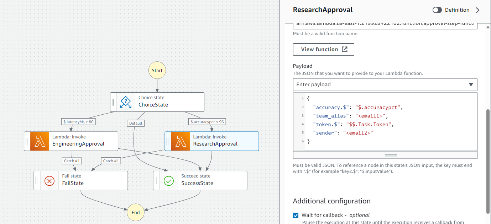

# Lab 04 - https://aws.amazon.com/blogs/devops/new-fine-grained-continuous-delivery-with-codepipeline-and-aws-stepfunctions/#:~:text=Complete%20the%20following%20steps%3A%201%20On%20the%20CodePipeline,Action%20to%20the%20action%20group.%20...%20More%20items

## Create CodePipeline with CodeCommit and CodeBuild Components

* Create a Cloud9 environment in a new ACG playground
* Clone the lab repository using `git clone https://github.com/KernelGamut32/cloud-accelerator-program-aws-public.git`
* Navigate to the `week03/labs/lab04` directory using `cd cloud-accelerator-program-aws-public/week03/labs/lab04`
* Create a new S3 bucket for storage of the provided `buildspec.yml` file using `aws s3 mb s3://<YOUR_BUCKET_NAME>`
* Copy the provided `source.zip` file (which contains the `buildspec.yml` file) to the newly created bucket using `aws s3 cp source.zip s3://<YOUR_BUCKET_NAME>`
* Update `inputs.json` using `vi inputs.json` to change parameter value to the name of the bucket you created in previous step (use `i` to enter INSERT mode and use `:wq!` to save changes)
* Execute the included `codepipeline.yaml` CloudFormation template to create a CodePipeline with CodeCommit and CodeBuild components using `aws cloudformation create-stack --stack-name code-pipeline-lab --parameters file://./inputs.json --template-body file://./codepipeline.yaml --capabilities CAPABILITY_IAM`
* Use `aws cloudformation describe-stack-events --stack-name code-pipeline-lab` to monitor the progress of the stack creation
* Use `aws cloudformation describe-stacks --stack-name code-pipeline-lab` to monitor overall stack status
* Package the approval step function using `aws cloudformation package --template-file approval.yaml --s3-bucket <YOUR_BUCKET_NAME> --output-template-file workflow-template.yaml`
* Deploy the approval step function using `aws cloudformation deploy --template-file workflow-template.yaml --stack-name approval-step-function --capabilities CAPABILITY_IAM`
* Navigate to the Simple Email Service instance created by the CFT and add two **different** email addresses that you have access to under `Verified Identities`
* Access the email sent to those addresses to verify
* In the MC, navigate to the approval Step Function and click "Edit"
* Click the "EngineeringApproval" state, scroll down to "Payload" section; update `team_alias` and `sender` values to the two different email addresses


* Repeat the same step for the "ResearchApproval" state



* Pick up from the remaining instructions outlined in the provided lab URL to inject the approval step function into the CodePipeline; when instructed to select an input artifact, use `SourceArtifact` (in reality, you would likely be using the results of the build process but our build process here is minimal)
* To test the pipeline, create a `results.json` file in the `main` branch of the CodeCommit repo; use the following contents for the file to test the engineering approval route

```
{
  "accuracypct": 100,
  "latencyMs": 225
}
```

* Update the `results.json` file in the `main` branch of the CodeCommit repo; use the following contents for the file to test the research approval route

```
{
  "accuracypct": 89,
  "latencyMs": 75
}
```

* Observe the build progress in CodePipeline and select different combinations of `PASS` or `FAIL` to see the processing (you may need to check junk or spam for the approval emails)