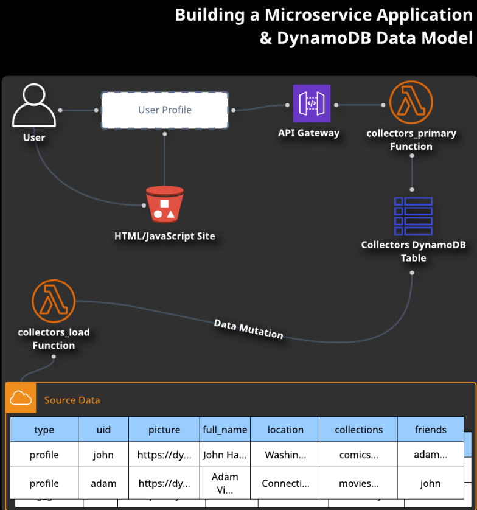

# Lab 05 - [Microservices with DynamoDB](https://learn.acloud.guru/handson/ab9e8bda-1f6f-4af8-9465-f8e3e14cc7d1)

**NOTE: Use an A Cloud Guru (ACG) AWS Playground for this lab**

**If you encounter "no space left on device issues", use https://ryansouthgate.com/aws-cloud9-no-space-left-on-device/#:~:text=There%E2%80%99s%20a%20few%20things%20we%20can%20tackle%20here%2C,clean%20up%20that%20much%20free%20space%20for%20me**

1. In the lab environment, create a new Cloud9 environment using the following steps:
    - Open `CloudShell` (in the upper right)
    - Clone this repository to `CloudShell` using `git clone https://github.com/KernelGamut32/cloud-accel-aws-2024-public.git`
    - Navigate to the root folder using `cd cloud-accel-aws-2024-public`
    - Execute the bash script to create a new Cloud9 environment using `./cloud9.sh '<env-name>' 't3.medium' 'amazonlinux-2023-x86_64'` (replace `<env-name>` with your environment name)
    - Close `CloudShell`
    - In the search bar, search for `Cloud9` (open in a new tab)
    - Click the radio button next to your environment and click `Open in Cloud9`
    - Execute the remaining instructions in the Cloud9 environment
1. In the provided terminal, clone this repository using `git clone https://github.com/KernelGamut32/cloud-accel-aws-2024-public.git`
1. Navigate to the target folder using `cd cloud-accel-aws-2024-public/week03/labs/lab05/dynamodb-load`; feel free to also explore the contents of the provided CDK files
1. Run `npm install` to install the required dependencies
1. Run `cdk bootstrap` to bootstrap the CDK environment
1. Run `cdk synth` to view the template that will be generated for the CDK stack
1. Run `cdk deploy` to deploy the CDK stack
1. Execute the table load using `aws lambda invoke --function-name collectors_load --payload '{}' /dev/stdout`
1. Using the output URL for the API Gateway, navigate to that URL in a browser and reference the `collectors` endpoint to retrieve data from the DynamoDB table through the Lambda
    - For example: `https://<api-gateway-url>/prod/collectors?uid=adam&request=all`
    - Or: `https://<api-gateway-url>/prod/collectors?uid=adam&request=profile`
    - See types of calls in the `collectors_primary` Lambda code
