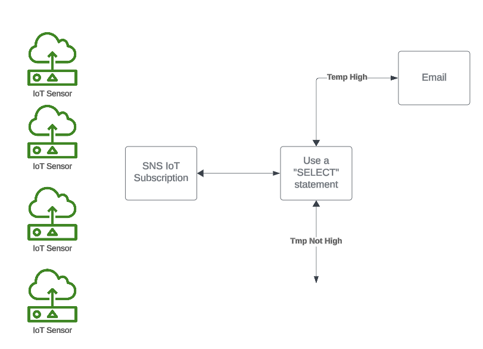

# Lab 03 - [Processing IoT Events Through SNS](https://docs.aws.amazon.com/iot/latest/developerguide/iot-sns-rule.html)

**NOTE: Use an A Cloud Guru (ACG) AWS Playground for this lab**

**If you encounter "no space left on device issues", use https://ryansouthgate.com/aws-cloud9-no-space-left-on-device/#:~:text=There%E2%80%99s%20a%20few%20things%20we%20can%20tackle%20here%2C,clean%20up%20that%20much%20free%20space%20for%20me**

1. In the lab environment, create a new Cloud9 environment using the following steps:
    - Open `CloudShell` (in the upper right)
    - Clone this repository to `CloudShell` using `git clone https://github.com/KernelGamut32/cloud-accel-aws-2024-public.git`
    - Navigate to the root folder using `cd cloud-accel-aws-2024-public`
    - Execute the bash script to create a new Cloud9 environment using `./cloud9.sh '<env-name>' 't3.medium' 'amazonlinux-2023-x86_64' <sleep-time>` (replace `<env-name>` with your environment name and `<sleep-time>` with the targeted delay)
    - Close `CloudShell`
    - In the search bar, search for `Cloud9` (open in a new tab)
    - Click the radio button next to your environment and click `Open in Cloud9`
    - Execute the remaining instructions in the Cloud9 environment
1. In the provided terminal from the `~/environment` folder, clone the class repository using `git clone https://github.com/KernelGamut32/cloud-accel-aws-2024-public.git`
1. Review the `notification.yaml` file and the `inputs.json` file
1. Open `inputs.json` in the IDE and replace `<email address>` with a valid email address
1. Create the AWS resources using the CloudFormation template in the lab repository by running `aws cloudformation create-stack --stack-name IOT-SNS --parameters file://./cloud-accel-aws-2024-public/week04/labs/lab03/inputs.json  --template-body file://./cloud-accel-aws-2024-public/week04/labs/lab03/notification.yaml --capabilities CAPABILITY_IAM`
1. Run `aws cloudformation describe-stack-events --stack-name IOT-SNS` to check the status of the stack creation (or view in the CloudFormation Management Console)
1. You will need to confirm the subscription at the email address used for the parameter before sending test data
1. Once the CloudFormation deployment completes, use the AWS Console and follow along with `Step 3: Test the AWS IoT rule and Amazon SNS notification` to test the rule and notification
1. Use `aws cloudformation delete-stack --stack-name IOT-SNS` to delete the AWS resources for the lab
