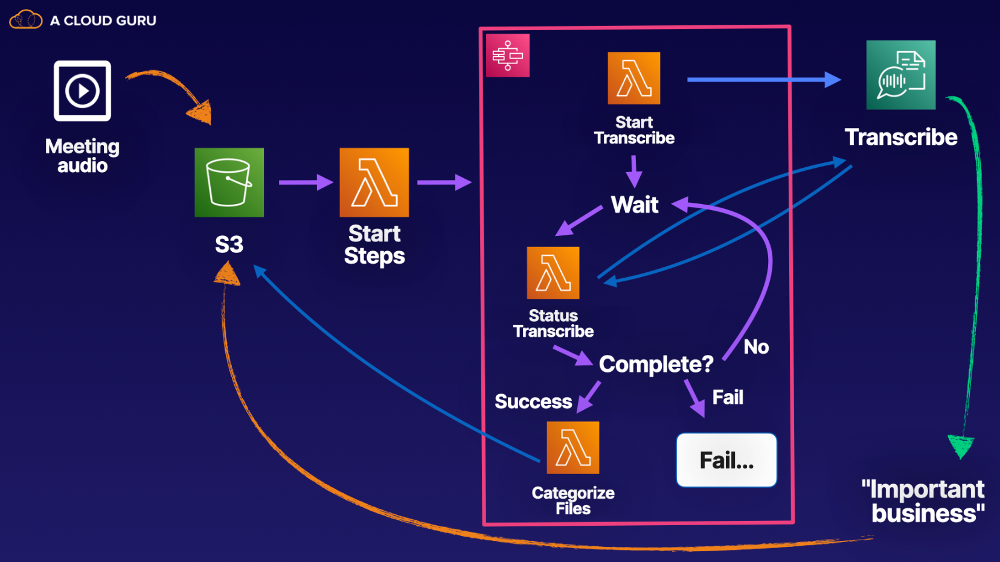

# Lab 02 - [Categorizing Data Using Step Functions](https://learn.acloud.guru/handson/5197c509-cdee-42b7-a30f-2c47980a10f3)

**NOTE: Use an A Cloud Guru (ACG) AWS Playground for this lab**

**If you encounter "no space left on device issues", use https://ryansouthgate.com/aws-cloud9-no-space-left-on-device/#:~:text=There%E2%80%99s%20a%20few%20things%20we%20can%20tackle%20here%2C,clean%20up%20that%20much%20free%20space%20for%20me**

1. In the lab environment, create a new Cloud9 environment using the following steps:
    - Open `CloudShell` (in the upper right)
    - Clone this repository to `CloudShell` using `git clone https://github.com/KernelGamut32/cloud-accel-aws-2024-public.git`
    - Navigate to the root folder using `cd cloud-accel-aws-2024-public`
    - Execute the bash script to create a new Cloud9 environment using `./cloud9.sh '<env-name>' 't3.medium' 'amazonlinux-2023-x86_64' <sleep-time>` (replace `<env-name>` with your environment name and `<sleep-time>` with the targeted delay)
    - Close `CloudShell`
    - In the search bar, search for `Cloud9` (open in a new tab)
    - Click the radio button next to your environment and click `Open in Cloud9`
    - Execute the remaining instructions in the Cloud9 environment
1. In the provided terminal from the `~/environment` folder, clone the project repository using `git clone https://github.com/KernelGamut32/categorize-data.git`
1. Navigate to the target folder using `cd categorize-data`; feel free to explore the contents of the provided CDK files
1. With this CDK project, we are going to use `projen` to help us manage configuration and execution of our app (https://aws.amazon.com/blogs/devops/getting-started-with-projen-and-aws-cdk/)
1. Run `npm install` to install the required dependencies
1. Run `npx projen` to incorporate and confirm any configuration updates
1. Run `npx cdk bootstrap` in the terminal to bootstrap the CDK environment
1. If you run into any issues running `npx cdk bootstrap`, execute the following steps:
    - Click the "Cloud9" logo in the upper left corner of the IDE and click "Preferences"
    - Click "AWS Settings" and uncheck "AWS managed temporary credentials"
    - In the Cloud9 terminal, run `aws configure` and set access key ID (from ACG credentials), secret access key (from ACG credentials), and default region (`us-east-1`)
    - Run `npx cdk bootstrap` again and confirm completes successfully
1. Run `npx projen build` to build the application, synthesize the CloudFormation template, and run the tests & linter for the project to validate
1. Run `npx projen deploy` to deploy the CDK stack
1. When deploy completes, you can verify the presence of the Lambdas, S3 bucket, roles, and Step Function
1. Download `ImportantBusiness.mp3` from `https://github.com/KernelGamut32/cloud-accel-aws-2024-public/blob/main/week05/labs/lab02`
1. Navigate to the S3 bucket and create a new folder called `upload`
1. Navigate to that folder and upload the `ImportantBusiness.mp3` file
1. Upon upload, based on the configuration of the AWS resources, that file will automatically trigger the Step Function to transcribe the mp3 and evaluate it for the presence of "important" keywords
1. Navigate to the Step Functions console to visually watch the flow
1. Once the Step Function execution is complete, you can navigate to S3 to confirm the proper processing of the mp3 and its transcript
1. Run `npx projen destroy` from the project folder to delete the AWS resources for the lab
