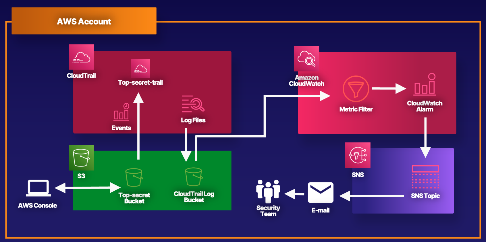

# Lab 01 - [CloudWatch & CloudTrail](https://learn.acloud.guru/handson/a3839dd5-7088-4941-9e7e-fd04f006ccd2)

**NOTE: Use an A Cloud Guru (ACG) AWS Playground for this lab**

**If you encounter "no space left on device issues", use https://ryansouthgate.com/aws-cloud9-no-space-left-on-device/#:~:text=There%E2%80%99s%20a%20few%20things%20we%20can%20tackle%20here%2C,clean%20up%20that%20much%20free%20space%20for%20me**

1. In the lab environment, create a new Cloud9 environment by navigating to the Cloud9 console and clicking `Create environment` (or reuse a previously-created environment)
    - Specify a name for the environment
    - Select `Additional instance types` and choose `t3.medium`
    - Leave all other options at their defaults, and click `Create`
    - Wait for the Cloud9 environment creation to complete and click the link for your newly created environment
    - Under `EC2 instance` click `Manage EC2 instance`
    - Click the `Instance ID` link
    - Select `Storage`, click the `Volume ID` link, click the checkbox next to your volume, and select `Modify volume` from the `Actions` dropdown
    - Increase size from `10` to `30` GiB; click `Modify` and click `Modify` in the confirmation dialog
    - Reboot your EC2 instance
    - Go back to Cloud9, click the radio button next to your Cloud9 environment, and click `Open in Cloud9`
    - In the terminal window, you can run `lsblk` to confirm new size
1. In the provided terminal from the `~/environment` folder, clone the project repository using `git clone https://github.com/KernelGamut32/cloudwatch-alarms.git`
1. Navigate to the target folder using `cd cloudwatch-alarms`; feel free to explore the contents of the provided CDK files
1. With this CDK project, we are going to use `projen` to help us manage configuration and execution of our app (https://aws.amazon.com/blogs/devops/getting-started-with-projen-and-aws-cdk/)
1. From the terminal, run `nano .projenrc.ts` to open the `projen` config file; under `context`, update the `emailAddress` to an address where you can receive notifications
1. Run `npm install` to install the required dependencies
1. Run `npx projen` to incorporate and confirm any configuration updates
1. Run `npx cdk bootstrap` in the terminal to bootstrap the CDK environment
1. If you run into any issues running `npx cdk bootstrap`, execute the following steps:
    - Click the "Cloud9" logo in the upper left corner of the IDE and click "Preferences"
    - Click "AWS Settings" and uncheck "AWS managed temporary credentials"
    - In the Cloud9 terminal, run `aws configure` and set access key ID (from ACG credentials), secret access key (from ACG credentials), and default region (`us-east-1`)
    - Run `npx cdk bootstrap` again and confirm completes successfully
1. Run `npx projen build` to build the application, synthesize the CloudFormation template, and run the tests & linter for the project to validate
1. Run `npx projen deploy` to deploy the CDK stack
1. When deploy completes, you can verify the presence of the S3 bucket, SNS topic, CloudWatch log group, metric filter, and alarm, and CloudTrail trail
1. You will also need to navigate to the email address you provided and confirm the subscription to the SNS topic
1. Navigate to the "top secret" S3 bucket - try a few operations (upload, download, open, delete); after a few minutes, you should receive a notification of alarm
1. Run `aws cloudwatch set-alarm-state --alarm-name AccessS3BucketAlarm --state-value OK --state-reason "Testing alarm"` to temporarily clear the alarm
1. In the "top secret" S3 bucket, try your operations again to cause another alarm/alert
1. Run `npx projen destroy` from the project folder to delete the AWS resources for the lab
