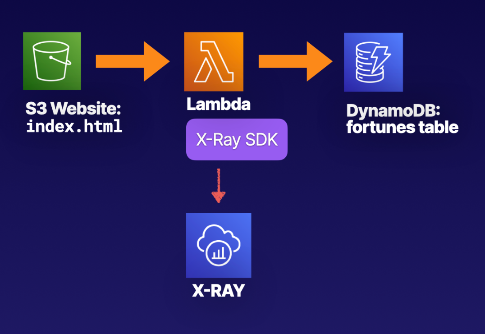

# Lab 02 - [Troubleshooting Serverless](https://learn.acloud.guru/handson/b5512e9f-29eb-46da-a9c2-66d1ffc0fe78)

1. Use the provided lab environment to follow along with the "Guide" tab in the lab
1. When prompted to upload `layer.zip` for the new layer, use the version of `layer.zip` provided in the week 06 / lab 02 folder (it includes a required refresh to one of the dependencies)
